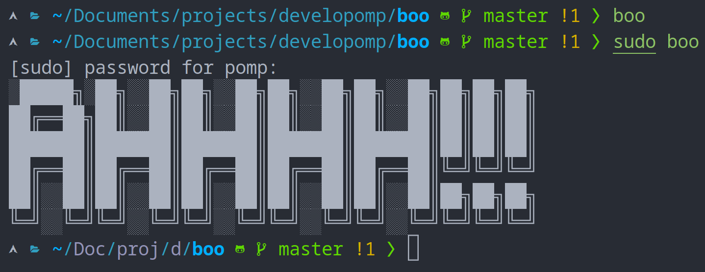

# sudo-boo

[](https://crates.io/crates/sudo-boo)
[](https://crates.io/crates/sudo-boo)

<p align="center">
    
</p>

## Installation

```
cargo install sudo-boo
```

## Usage

<p align="center">
    
</p>
